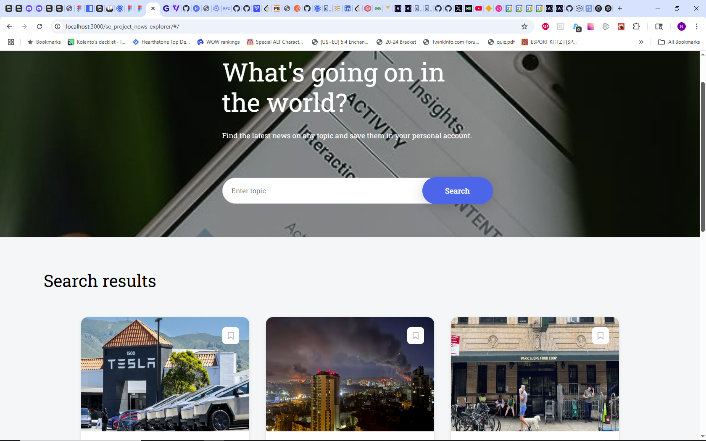
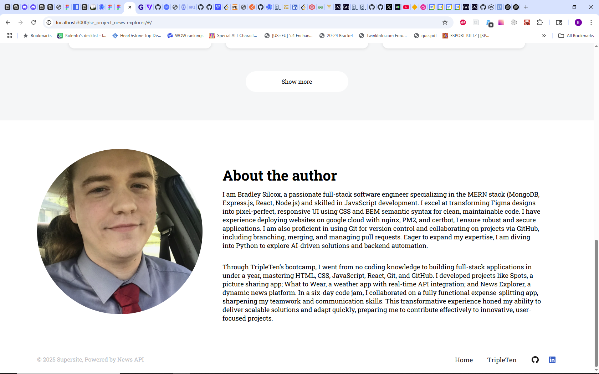
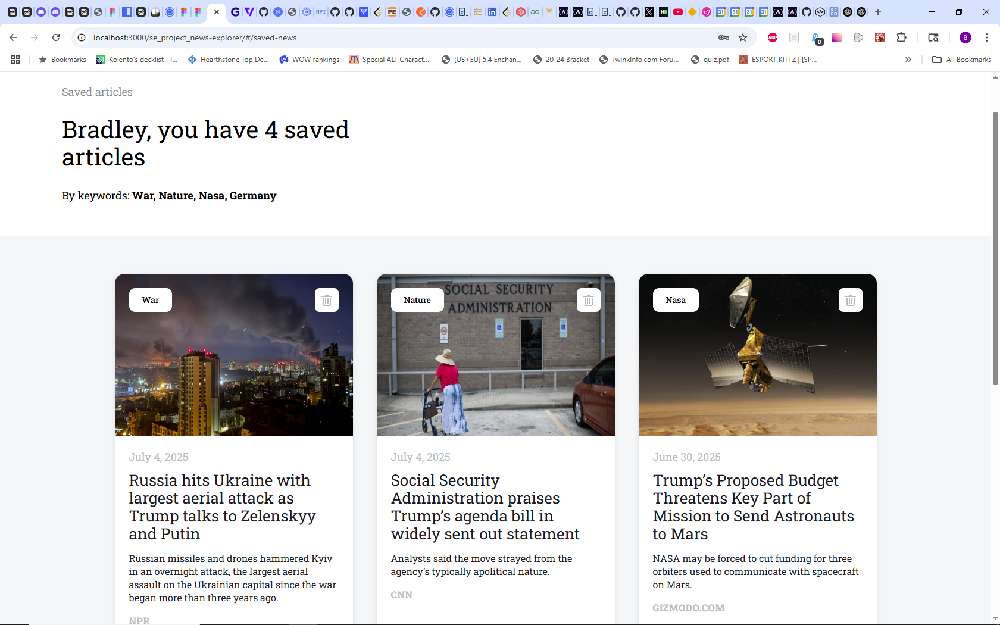

# NewsExplorer: Front End

The NewsExplorer front end is a responsive, user-friendly single-page application(SPA) built with React. It connects to a news API that allows users to search for topics and view recent news articles based on thier query. Users can save articles to their profile to read later and delete them when they are done.

## Tech Stack

- React.js: Javascript library for building a dynamic, component-based user interface.
- React Router: Handles client-side routing for seamless navigation within the SPA.
- ESLint & Prettier: Enforces code quality and consistent formatting.
- Vite: Build tool for fast development and optimized production builds.
- React Hooks: Manages state and side effects in functional components.
- React Context: Centralized state management for user data.
- CSS: Component-specific CSS files, with each React component paired with a dedicated .css file, styled using the BEM naming convention for clear, conflict-free class naming.
- News API: Provides real-time news articles to keep users up to date on the latests topics.
- Figma: Used for designing the UI prototype.

## Images

## Deployment Link

This website is deployed on GitHub pages.

-[Deployment Link](https://bsilcox1990.github.io/se_project_news-explorer/)
